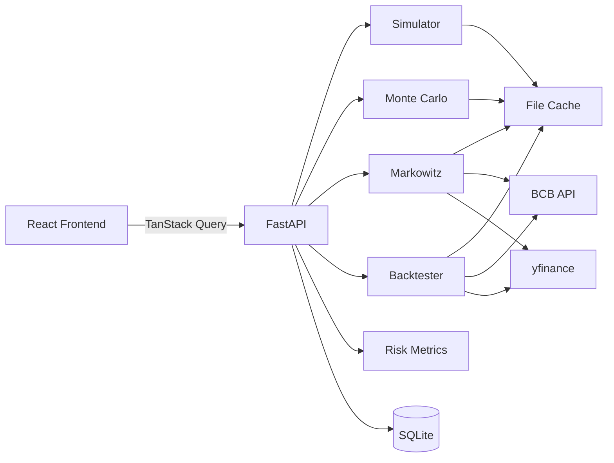

# Patrimônio 💰

> Simulador profissional de investimentos de longo prazo para o mercado brasileiro.

[](https://github.com/yourusername/patrimonio/actions)
[](https://github.com/yourusername/patrimonio/actions)
[](https://python.org)
[](https://fastapi.tiangolo.com)
[](https://react.dev)
[](https://typescriptlang.org)
[](LICENSE)

---

> ⚠️ **Disclaimer**: Este aplicativo tem caráter exclusivamente educacional e ilustrativo. Não constitui recomendação de investimento, oferta de produto financeiro, consultoria ou análise de valores mobiliários. Retornos passados não garantem retornos futuros. Consulte um profissional certificado (CVM) antes de tomar decisões financeiras.

---

## ✨ Features

- 📈 **Simulador de Aportes** — Juros compostos com aportes crescentes e ajuste de inflação (IPCA)
- 📊 **Backtesting Histórico** — Dados reais de mercado via BCB e yfinance, com rebalanceamento e tributação BR
- 🎲 **Monte Carlo** — 10.000+ trajetórias por GBM ou Bootstrap histórico, com bandas de percentis
- 🎯 **Fronteira Eficiente** — Otimização de Markowitz (mínima variância e máximo Sharpe)
- ⚖️ **Métricas de Risco** — Sharpe, Sortino, VaR 95%, CVaR, Maximum Drawdown, Beta, Calmar
- 🇧🇷 **Tributação Realista** — Tabela regressiva IR, IOF, isenção LCI/LCA, come-cotas, isenção R$20k ações
- 🌙 **Dark Mode** — Toggle persistido, mobile-first e responsivo
- 💾 **Comparar Cenários** — Salve até 4 cenários em localStorage e compare lado a lado
- 📚 **Educacional** — Tooltips explicativos, página de conceitos com fórmulas

## 🛠 Stack

| Camada | Tecnologias |
|--------|-------------|
| **Backend** | Python 3.11 · FastAPI · Pydantic v2 · SQLAlchemy 2.0 · pandas · numpy · scipy |
| **Dados** | python-bcb (Banco Central) · yfinance · Parquet cache |
| **Frontend** | React 18 · TypeScript strict · Vite · TailwindCSS · Recharts |
| **Estado** | TanStack Query · Zustand · react-hook-form + zod |
| **DevOps** | Docker multi-stage · GitHub Actions · pytest · vitest |

---

## 🚀 Quick Start (Docker)

```bash
# 1. Clone
git clone https://github.com/yourusername/patrimonio.git
cd patrimonio

# 2. Suba os serviços
docker compose up -d

# 3. Abra no browser
open http://localhost
```

A API Swagger fica em: `http://localhost/api/v1/docs`

---

## 🛠 Quick Start (Local, sem Docker)

### Backend

```bash
cd backend

# Criar ambiente virtual
python -m venv .venv
.venv\Scripts\activate          # Windows
# source .venv/bin/activate     # Linux/Mac

# Instalar dependências
pip install -e ".[dev]"

# Rodar servidor
uvicorn app.main:app --reload
# API em http://localhost:8000 · Swagger em http://localhost:8000/docs
```

### Frontend

```bash
cd frontend

npm install
npm run dev
# Frontend em http://localhost:5173
```

---

## 🧪 Testes

```bash
# Backend
cd backend
pytest --cov=app -v

# Frontend
cd frontend
npm test
```

---

## 📁 Arquitetura

```
patrimonio/
├── backend/
│   ├── app/
│   │   ├── api/routes/         # FastAPI routes
│   │   ├── core/               # Config, DB, cache, exceptions
│   │   ├── models/             # SQLAlchemy models
│   │   ├── schemas/            # Pydantic schemas
│   │   ├── services/           # Financial computation engines
│   │   │   ├── simulator.py    # Monthly contribution simulator
│   │   │   ├── monte_carlo.py  # GBM + Bootstrap simulation
│   │   │   ├── markowitz.py    # Efficient frontier (scipy)
│   │   │   ├── risk_metrics.py # Sharpe, VaR, drawdown, beta
│   │   │   ├── backtester.py   # Historical backtest
│   │   │   ├── tax_calculator.py # Brazilian tax rules
│   │   │   └── data_fetchers/  # BCB, yfinance, Tesouro
│   │   └── utils/              # Financial math, date helpers
│   └── tests/                  # pytest test suite (30+ tests)
│
├── frontend/
│   └── src/
│       ├── components/         # Charts, UI primitives, educational
│       ├── pages/              # SimulatorPage, MonteCarloPage, ...
│       ├── hooks/              # TanStack Query hooks
│       ├── store/              # Zustand scenario store
│       └── types/              # TypeScript API types
│
├── docs/
│   ├── FINANCIAL_MATH.md       # Fórmulas com LaTeX (Markowitz, GBM, VaR...)
│   └── ARCHITECTURE.md         # ADRs e decisões de design
│
├── docker-compose.yml
└── .github/workflows/          # Backend CI + Frontend CI + Docker build
```



---

## 📡 API

Swagger completo em `/api/v1/docs`. Principais endpoints:

```bash
# Simular aportes mensais
POST /api/v1/simulations/

# Monte Carlo (GBM ou Bootstrap)
POST /api/v1/monte-carlo/

# Backtesting histórico multi-ativo
POST /api/v1/backtest/

# Fronteira eficiente de Markowitz
POST /api/v1/markowitz/

# Métricas de risco (Sharpe, VaR, drawdown...)
POST /api/v1/risk/metrics

# Taxas atuais (Selic, CDI) do Banco Central
GET  /api/v1/market-data/rates

# Lista de ativos disponíveis
GET  /api/v1/market-data/assets

# Comparação tributária
GET  /api/v1/market-data/tax-comparison
```

Exemplo de request:

```bash
curl -X POST http://localhost:8000/api/v1/simulations/ \
  -H "Content-Type: application/json" \
  -d '{
    "initial_investment": 5000,
    "monthly_contribution": 500,
    "annual_contribution_increase_pct": 5,
    "years": 30,
    "annual_rate_pct": 11.0,
    "inflation_pct": 4.5
  }'
```

---

## 🗺 Roadmap

- [x] Simulador de aportes mensais com inflação
- [x] Backtesting histórico multi-ativo
- [x] Monte Carlo (GBM + Bootstrap)
- [x] Fronteira eficiente de Markowitz
- [x] Tributação brasileira realista
- [x] Dark mode + responsivo
- [x] Comparação de cenários (localStorage)
- [x] CI/CD com GitHub Actions
- [ ] Importação de carteira (CSV B3)
- [ ] Black-Litterman (alternativa a Markowitz puro)
- [ ] Comparação com fundos CVM
- [ ] Calculadora de aposentadoria (regra dos 4%, FIRE)
- [ ] Deploy automático (Railway + Vercel)
- [ ] Internacionalização (EN)

---

## 🤝 Contribuindo

Veja [CONTRIBUTING.md](CONTRIBUTING.md). Em resumo:

```bash
# Fork → branch → commit (conventional) → PR
git checkout -b feat/minha-feature
git commit -m "feat: adicionar calculadora de aposentadoria FIRE"
```

---

## 📖 Documentação

- [Matemática Financeira](docs/FINANCIAL_MATH.md) — Fórmulas: GBM, Markowitz, VaR, CAGR
- [Arquitetura](docs/ARCHITECTURE.md) — ADRs e decisões de design
- [API Swagger](http://localhost:8000/docs) — OpenAPI interativo

---

## 📄 Licença

MIT © 2024 — veja [LICENSE](LICENSE)

---

## 🙏 Agradecimentos

- [Banco Central do Brasil](https://www.bcb.gov.br) — Séries históricas (SGS)
- [python-bcb](https://github.com/wilsonfreitas/python-bcb) — Wrapper BCB
- [yfinance](https://github.com/ranaroussi/yfinance) — Dados de mercado
- [FastAPI](https://fastapi.tiangolo.com) · [Pydantic](https://docs.pydantic.dev) · [Recharts](https://recharts.org)
- Harry Markowitz (1990 Nobel) · William Sharpe · Fischer Black & Myron Scholes
